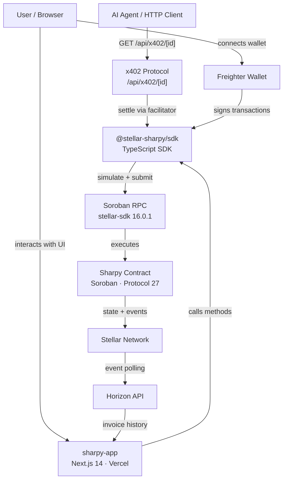

# sharpy-app


Next.js 14 frontend dApp for **Sharpy** — advanced on-chain split payment on Stellar. Supports recurring invoices, escrow-protected payments, batch operations, agentic x402 payments, and public on-chain verification.

## Live App

**https://sharpy-sigma.vercel.app**

**[Pitch Deck](https://gamma.app/docs/Split-Payments-on-Stellar-s0et8z1agtva59n)** · 


---

## Architecture



---

## Features

### Invoice Management
- Create invoices with Fixed, Percentage, or Tiered split rules
- Multi-recipient — split to any number of recipients
- Multi-token — USDC, XLM, AQUA, yXLM per recipient
- Recurring invoices — auto-generate next invoice on release
- Batch creation — up to 10 invoices in one transaction
- Cancel & refund — creator cancels and refunds all payers

### Payments
- Pay toward any invoice with Freighter wallet
- Pool payments — pay multiple invoices in one call
- Transaction confirmation step indicators (Signing → Submitting → Confirming → Done)
- QR code for sharing invoice payment links
- Copy-to-clipboard for invoice URLs and contract address

### Escrow
- Enable escrow on any invoice with configurable release delay
- Escrow release management page
- Dispute mechanism with optional arbitrator

### x402 Agentic Payments
- Public `/pay/[id]` page with wallet and x402 payment modes
- `/api/x402/[id]` endpoint — AI agents pay invoices via HTTP 402 protocol
- `GET` returns structured payment requirements, `POST` verifies and settles

### Verification & Transparency
- Public `/verify/[id]` — on-chain verification with no login required (SSR)
- SHA-256 invoice fingerprint display (Protocol 25/26 CAP-75/82)
- Audit log tab showing full on-chain history

### UX
- Dashboard with search and filter by status
- Dark/light mode with system preference detection
- Fully responsive — mobile-first layouts
- Skeleton loading states on all async pages

---

## Tech Stack

| Layer | Technology |
|-------|------------|
| Framework | Next.js 14 (App Router) |
| Language | TypeScript 5 |
| Styling | Tailwind CSS 3 + CSS custom properties |
| Fonts | Inter (body) + Space Grotesk (display) |
| Wallet | Freighter (`@stellar/freighter-api` v3) |
| Contract SDK | `@stellar-sharpy/sdk` (local workspace) |
| x402 | `@x402/stellar` v2.17.0 |
| Deploy | Vercel |

---

## Pages & Routes

| Route | Type | Description |
|-------|------|-------------|
| `/` | Static | Landing page with feature highlights and CTAs |
| `/dashboard` | Client | Wallet-gated invoice list with search and filter |
| `/invoice/new` | Client | Create invoice — single, escrow, or recurring |
| `/invoice/[id]` | Dynamic | Invoice detail, funding progress, pay button, QR code |
| `/invoice/[id]/escrow` | Dynamic | Escrow release and dispute management |
| `/invoice/[id]/recurring` | Dynamic | Recurring invoice chain viewer |
| `/invoice/[id]/cancel` | Dynamic | Creator cancel and refund |
| `/verify/[id]` | SSR | Public on-chain verification with fingerprint |
| `/pay/[id]` | Client | Public shareable payment page — wallet + x402 |
| `/api/x402/[id]` | API | x402 HTTP endpoint (GET: requirements, POST: settle) |

---

## Local Setup

### Prerequisites

- Node.js 20+
- [Freighter wallet](https://freighter.app) browser extension

### Install & Run

```bash
git clone https://github.com/stellar-sharpy/sharpy-app.git
cd sharpy-app
npm install
cp .env.example .env.local
# Edit .env.local with your values
npm run dev
```

Open [http://localhost:3000](http://localhost:3000).

### Environment Variables

```bash
NEXT_PUBLIC_STELLAR_NETWORK=testnet
NEXT_PUBLIC_CONTRACT_ID=CAYTIFPD6RFWVHMK5SPPUUIWWAAANHKOJB6GOAJS5SR5MBKZMEY2UODZ
NEXT_PUBLIC_RPC_URL=https://soroban-testnet.stellar.org
NEXT_PUBLIC_USDC_CONTRACT_ID=CBIELTK6YBZJU5UP2WWQEUCYKLPU6AUNZ2BQ4WWFEIE3USCIHMXQDAMA
```

| Variable | Description |
|----------|-------------|
| `NEXT_PUBLIC_STELLAR_NETWORK` | `testnet` or `mainnet` |
| `NEXT_PUBLIC_CONTRACT_ID` | Deployed Sharpy contract ID |
| `NEXT_PUBLIC_RPC_URL` | Soroban RPC endpoint URL |
| `NEXT_PUBLIC_USDC_CONTRACT_ID` | Native USDC contract ID on network |

---

## Build

```bash
npm run build    # builds SDK workspace then Next.js
npm run start    # production server
npm run lint     # ESLint + TypeScript check
npm run test:e2e # Playwright end-to-end tests
```

---

## Project Structure

```
sharpy-app/
├── packages/
│   └── sdk/                    # @stellar-sharpy/sdk (local workspace)
│       ├── src/
│       │   ├── client.ts       # SharpyClient — all contract methods
│       │   ├── wallet.ts       # Freighter v3 wallet helpers
│       │   ├── utils.ts        # parseAmount, formatAmount, etc.
│       │   ├── errors.ts       # Typed error classes
│       │   └── index.ts        # Public exports + NETWORKS constant
│       └── package.json
├── src/
│   ├── app/                    # Next.js App Router
│   │   ├── page.tsx            # Landing page
│   │   ├── layout.tsx          # Root layout
│   │   ├── globals.css         # Tailwind + CSS design system
│   │   ├── dashboard/
│   │   ├── invoice/
│   │   │   ├── new/
│   │   │   └── [id]/
│   │   │       ├── page.tsx
│   │   │       ├── escrow/
│   │   │       ├── recurring/
│   │   │       └── cancel/
│   │   ├── pay/[id]/           # Public shareable payment page
│   │   ├── verify/[id]/        # SSR public verification
│   │   └── api/x402/[id]/      # x402 HTTP payment endpoint
│   ├── components/
│   │   ├── Navbar.tsx          # Sticky navbar with theme toggle
│   │   ├── WalletProvider.tsx  # Freighter wallet context
│   │   ├── Providers.tsx       # ThemeProvider + WalletProvider
│   │   ├── TokenSelector.tsx   # Multi-token dropdown
│   │   └── CopyButton.tsx      # Copy to clipboard
│   └── lib/
│       ├── client.ts           # SDK client setup from env vars
│       ├── tokens.ts           # Token registry (USDC, XLM, AQUA, yXLM)
│       └── utils.ts            # Formatting helpers
├── public/
│   ├── logo.svg
│   ├── logo.png
│   └── favicon.ico
├── .env.example
├── next.config.js
├── tailwind.config.js
└── package.json
```

---

## Protocol Compatibility

| stellar-sdk | Protocol | Status | Features |
|-------------|----------|--------|---------|
| 16.0.1 | 27 | ✅ Current | CAP-71 auth delegation ready |

### Protocol 25/26 Integration

| Feature | Route | Description |
|---------|-------|-------------|
| Invoice fingerprint (CAP-75/82) | `/verify/[id]` | SHA-256 content hash displayed with copy button |
| TTL extension (CAP-78) | SDK `bumpInvoiceTtl` | Available via SDK for long-lived invoice maintenance |

---

## Related Repos

| Repo | Description |
|------|-------------|
| [sharpy-contracts](https://github.com/stellar-sharpy/sharpy-contracts) | Soroban smart contract (Rust) |
| [sharpy-sdk](https://github.com/stellar-sharpy/sharpy-sdk) | TypeScript SDK |

---

## Contributing

See [CONTRIBUTING.md](CONTRIBUTING.md). Always test with Freighter connected to testnet before opening a PR.

## Security

See [SECURITY.md](SECURITY.md) for the vulnerability disclosure process.

## License

[MIT](LICENSE)
